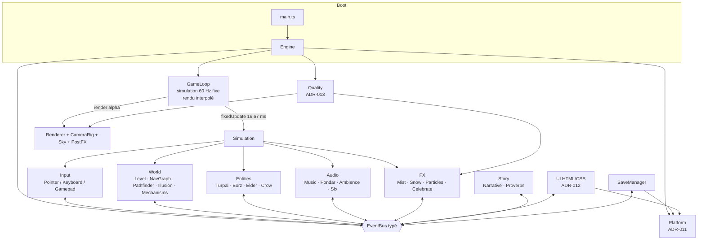
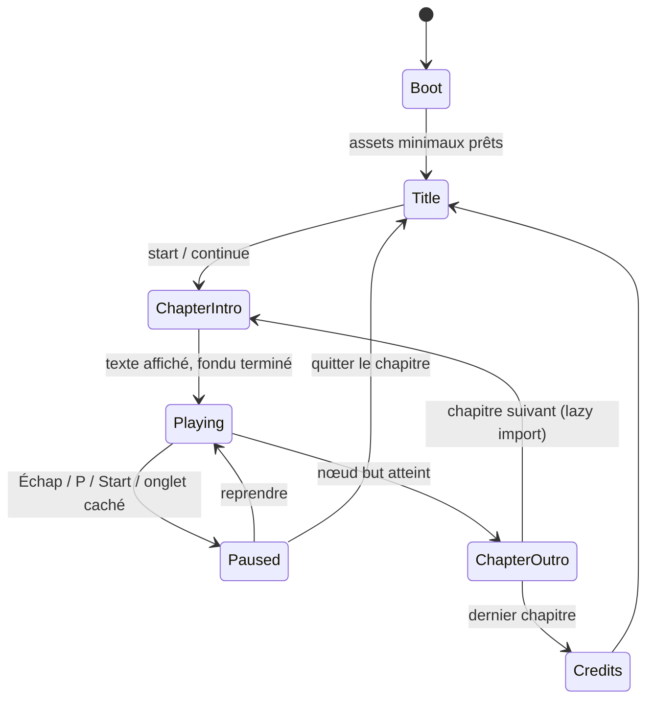

# ARCHITECTURE — BӀOV : Les Tours du Silence

Trois règles d'étanchéité, opposables en revue (`AGENTS.md` § 3) :

1. le **gameplay ignore le DOM** ;
2. l'**UI ignore three.js** ;
3. la **plateforme ignore le jeu**.

Les seuls franchissements autorisés passent par l'`EventBus` et par
`PlatformAdapter`.

---

## 1. Vue d'ensemble



**Pourquoi un pas fixe** : la simulation (déplacement, mécanismes,
déclencheurs) tourne à 60 Hz exactement, `delta` borné à 100 ms
(`core/Time.ts`) ; le rendu interpole avec `alpha`. Conséquence : le jeu se
comporte pareil à 30, 60 ou 144 fps, et un onglet en arrière-plan ne produit
jamais un saut de simulation.

**L'EventBus est typé** : `EventBus<InputEvents>`, `EventBus<GameEvents>` —
pas de chaînes magiques, pas de `any`. Un abonné qui écoute un événement
inexistant ne compile pas.

---

## 2. Machine à états du jeu

`src/core/StateMachine.ts` (8 tests unitaires : transitions invalides refusées
silencieusement, ordre `onExit` → `onEnter`, contexte, historique).



| État           | Ce qui tourne                                                     | Ce qui est gelé                              |
| -------------- | ----------------------------------------------------------------- | -------------------------------------------- |
| `Boot`         | Loader CSS pur (aucun JS de rendu), détection de qualité initiale | tout le reste                                |
| `Title`        | Scène de titre légère, musique couche 0                           | simulation du niveau                         |
| `ChapterIntro` | Texte (2 phrases), fondu 1200 ms, préchargement du niveau         | entrées joueur                               |
| `Playing`      | Tout                                                              | —                                            |
| `Paused`       | UI, rendu figé sur la dernière image                              | simulation, audio ducké à −∞ si onglet caché |
| `ChapterOutro` | Illumination des tours, bénédiction, proverbe, sauvegarde         | entrées, sauf « passer »                     |
| `Credits`      | Défilement + crédits de relecture culturelle                      | —                                            |

Une transition non déclarée est **ignorée sans erreur** : un double clic sur
« reprendre » ne peut pas casser la partie.

---

## 3. Format de données d'un niveau

`src/world/Level.ts`. Un niveau est une **donnée**, pas du code (ADR-010) :
lisible, différable, validable à la compilation.

```ts
export interface LevelDefinition {
  readonly id: string; // '04-patience'
  readonly chapter: number; // 0 = prologue
  readonly virtue: Virtue;
  readonly titleKey: string; // clé i18n
  readonly proverbKey: string;

  readonly sky: SkyPaletteName; // 'dawn' | 'mist' | 'dusk' | 'snow'
  readonly palette?: ChapterPaletteName; // docs/ART_DIRECTION.md § 3
  readonly music?: {
    readonly mode: 'dorian' | 'aeolian';
    readonly root: string; // 'D'
    readonly strings: readonly [string, string, string]; // ['D3','A3','D4']
  };

  readonly spawn: NodeId;
  readonly goal: NodeId;

  readonly geometry?: readonly LevelBlockDef[]; // blocs, tours, escaliers…
  readonly nodes: readonly LevelNodeDef[]; // id, position, up, surface
  readonly edges: readonly LevelEdgeDef[]; // from, to, condition?
  readonly mechanisms?: readonly LevelMechanismDef[];
  readonly triggers?: readonly LevelTriggerDef[]; // récit

  readonly camera?: {
    readonly target?: readonly [number, number, number];
    readonly zoom?: number; // remplace CAMERA.viewSize
  };
}
```

### Sous-structures

| Type                | Champs                                                                                                                                                  | Note                                                                                                                                                                                        |
| ------------------- | ------------------------------------------------------------------------------------------------------------------------------------------------------- | ------------------------------------------------------------------------------------------------------------------------------------------------------------------------------------------- |
| `LevelBlockDef`     | `kind` (`block \| tower \| stair \| bridge \| platform \| arch`), `at`, `size`, `rotationY?`, `parent?`, `surface?`                                     | `parent` rattache le bloc à un mécanisme : il bouge avec lui. Une tour se décrit par `[base, hauteur, base]`, le fruit et les gradins sont générés (canon dans `docs/ART_DIRECTION.md` § 2) |
| `LevelNodeDef`      | `id`, `at`, `tags?`, `surface?`, `up?`                                                                                                                  | `up` = direction du haut sur ce nœud (ADR-004) ; `surface` pilote le timbre des pas                                                                                                         |
| `LevelEdgeDef`      | `from`, `to`, `oneWay?`, `cost?`, `illusory?`, `condition?`                                                                                             | `condition: { mechanism: 'R', equals: 90 }` — arête conditionnelle (ADR-003)                                                                                                                |
| `LevelMechanismDef` | `id`, `kind`, `at`, `params?`, `affects?`                                                                                                               | `affects` liste les arêtes que le mécanisme ouvre ou ferme                                                                                                                                  |
| `LevelTriggerDef`   | `id`, `on` (`{node}` \| `{mechanism, equals}` \| `{levelStart}`), `play` (`{textKey}` \| `{gesture, by}` \| `{musicLayers}` \| `{eagleFound}`), `once?` | **aucun effet mécanique** : le récit n'ouvre jamais un passage                                                                                                                              |

### Exemple minimal (extrait de `src/levels/00-prologue.ts`)

```ts
export const level: LevelDefinition = {
  id: '00-prologue',
  chapter: 0,
  virtue: 'prologue',
  titleKey: 'levels.prologue.title',
  proverbKey: 'proverbs.threshold',
  sky: 'dawn',
  spawn: 'start',
  goal: 'summit',
  camera: { target: [0, 1.5, 0], zoom: 9 },
  nodes: [
    { id: 'start', at: [-3, 0, 3], tags: ['spawn'], surface: 'grass' },
    { id: 'court', at: [0, 0, 0], tags: ['rest'] },
    { id: 'summit', at: [3, 1.5, 0], tags: ['goal'] },
  ],
  edges: [
    { from: 'start', to: 'court' },
    { from: 'court', to: 'summit' },
  ],
};
```

---

## 4. Cycle de vie d'un niveau

```
load ──────► build ──────► play ──────► dispose
(lazy)       (données      (boucle)     (rien ne survit)
             → objets)
```

| Étape       | Ce qui se passe                                                                                                                                                                                                                 | Garantie                                                                                                            |
| ----------- | ------------------------------------------------------------------------------------------------------------------------------------------------------------------------------------------------------------------------------- | ------------------------------------------------------------------------------------------------------------------- |
| **load**    | `import('./levels/04-patience')` — chunk `level-04` séparé (ADR-010). Le chapitre suivant est préchargé pendant qu'on joue le courant.                                                                                          | Le bundle initial ne contient aucun niveau ; chaque chunk ≤ 400 ko gzip                                             |
| **build**   | `new Level(definition)` : construction du `NavGraph`, de la géométrie instanciée (une `InstancedMesh` par famille de blocs), des mécanismes, application de la palette et du ciel, auto-fit caméra, cuisson de l'AO de sommets. | ≤ 120 draw calls après construction                                                                                 |
| **play**    | `fixedUpdate` : mécanismes → graphe → entités → déclencheurs. `render` : interpolation + post-processing.                                                                                                                       | Zéro allocation par image                                                                                           |
| **dispose** | `Level.dispose()` → `mechanism.dispose()` pour chacun, `graph.clear()`, `disposeObject(root)` (géométries, matériaux, textures, cibles de rendu), retrait des abonnements de l'`EventBus`, `dispose()` des nœuds Tone.          | **Zéro fuite entre niveaux** (Definition of Done) : le nombre d'objets WebGL revient à sa valeur d'avant chargement |

Tout objet three créé hors d'un pool **doit** être libéré par
`utils/dispose.ts`. Un `new Material()` sans `dispose()` correspondant est un
échec de revue.

---

## 5. Stratégie de qualité

`src/core/Quality.ts` (ADR-013, 10 tests unitaires).

```
guessInitialTier()  →  mesure du fps sur 3 s  →  tier low | medium | high
   (pointeur, taille        (fenêtre glissante,       ↓
    d'écran, cœurs)          hystérésis 48/58)   applyQuality() sur
                                                 Renderer, PostFX, FX, Lighting
```

| Réglage                     | low             | medium          | high            |
| --------------------------- | --------------- | --------------- | --------------- |
| `maxPixelRatio`             | 1,0             | 1,5             | 2,0             |
| `shadows`                   | non             | 1024 px         | 2048 px         |
| `postFx` / `bloom` / `ssao` | non / non / non | oui / oui / non | oui / oui / oui |
| `antialias` (SMAA)          | non             | non             | oui             |
| `particleScale`             | 0,35            | 0,70            | 1,00            |

Règles dures : sur mobile, `shadows` est **toujours** `false`, quel que soit le
tier, même en choix manuel (ADR-022, verrouillé par test). Un choix manuel du
joueur **fige** l'adaptation. Toute transition de qualité est visuellement
douce — jamais une disparition brutale en pleine énigme.

---

## 6. Couche plateforme

`src/platform/Platform.ts` (ADR-011, ADR-014). Interface **asynchrone dès le
web**, pour que Capacitor se branche sans refactor.

| Service                                | Web (aujourd'hui)                      | Android via Capacitor (plus tard)   |
| -------------------------------------- | -------------------------------------- | ----------------------------------- |
| `getItem` / `setItem` / `removeItem`   | `localStorage`, enveloppé en `Promise` | `@capacitor/preferences`            |
| `vibrate(pattern)`                     | `navigator.vibrate`                    | `@capacitor/haptics`                |
| `requestFullscreen` / `exitFullscreen` | API Fullscreen                         | mode immersif                       |
| `keepAwake(bool)`                      | Screen Wake Lock                       | `@capacitor-community/keep-awake`   |
| `onPause` / `onResume`                 | `visibilitychange`                     | `App.addListener('appStateChange')` |
| `onBackButton`                         | —                                      | bouton retour matériel → **pause**  |

Règle de lint à venir : `localStorage`, `navigator.*` et `document.*` sont
interdits hors de `platform/` et `ui/`. Le jour du portage, **`CapacitorPlatform`
est la seule classe à écrire** (`docs/ANDROID_PORT.md`).

---

## 7. Arborescence et alias

| Alias                                                       | Dossier        | Contenu                                                           |
| ----------------------------------------------------------- | -------------- | ----------------------------------------------------------------- |
| `@core/*`                                                   | `src/core`     | Engine, GameLoop, Time, EventBus, StateMachine, Quality           |
| `@render/*`                                                 | `src/render`   | Renderer, CameraRig, Lighting, Sky, Palettes, PostFX, materials   |
| `@world/*`                                                  | `src/world`    | Level, LevelLoader, NavGraph, Pathfinder, Illusion, mechanisms    |
| `@entities/*`                                               | `src/entities` | ICharacterModel, player, companion, npc                           |
| `@input/*`                                                  | `src/input`    | InputManager, Pointer, Keyboard, Gamepad, Haptics                 |
| `@audio/*`                                                  | `src/audio`    | AudioManager, MusicSystem, PondarSynth, Ambience, SfxBank         |
| `@fx/*`                                                     | `src/fx`       | Particles, Mist, Snow, Fireflies, LightShafts, Celebrate          |
| `@ui/*`                                                     | `src/ui`       | UIRoot, écrans, `styles/tokens.css`                               |
| `@story/*`                                                  | `src/story`    | Narrative, Proverbs                                               |
| `@levels/*`                                                 | `src/levels`   | 8 chapitres + registre d'imports dynamiques                       |
| `@i18n/*`, `@save/*`, `@platform/*`, `@utils/*`, `@debug/*` | —              | traductions, sauvegarde, plateforme, utilitaires, outils de debug |

Les alias sont déclarés **trois fois** et doivent rester synchronisés :
`tsconfig.app.json`, `vite.config.ts`, `vitest.config.ts`.
